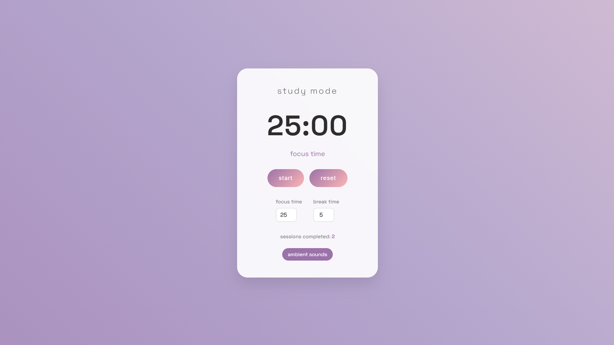

# 🌙 Lo-fi Study Timer

A beautiful, minimalist Pomodoro timer with ambient sounds and smooth animations.

## 🚀 Live Demo
[View Live Demo](https://cainebenoy.github.io/lofi-study-timer/)

## ✨ Features
- ⏱️ **Customizable Timer** - Set your own focus and break intervals (1-60 minutes)
- 🎵 **Ambient Sounds** - Optional lo-fi background music for better concentration
- 🌓 **Dark/Light Mode** - Toggle between light and dark themes with beautiful gradients
- 📊 **Session Tracking** - Tracks completed focus sessions with localStorage persistence
- ⌨️ **Keyboard Shortcuts** 
  - `Space` - Start/Pause timer
  - `R` - Reset timer
- 🎨 **Smooth Animations** - Beautiful gradient backgrounds and pulse effects
- 📱 **Fully Responsive** - Works perfectly on desktop, tablet, and mobile
- 💾 **Auto-save Settings** - Your preferences are saved automatically
- 🔔 **Audio Notifications** - Gentle sound alerts when sessions complete
- ⚡ **PWA Ready** - Install as an app on your device

## 📸 Screenshots



## 🛠️ Tech Stack
- **HTML5** - Semantic markup
- **CSS3** - Custom properties, animations, gradients
- **Vanilla JavaScript** - No frameworks, pure JS
- **LocalStorage API** - For data persistence
- **Web Audio API** - For notification sounds
- **PWA** - Progressive Web App capabilities

## 🏃‍♂️ Run Locally

1. Clone the repository
```bash
git clone https://github.com/cainebenoy/lofi-study-timer.git
```

2. Navigate to the project directory
```bash
cd lofi-study-timer
```

3. Open in your browser
```bash
# Using Python
python -m http.server 8000

# Using Node.js
npx serve

# Or simply open index.html in your browser
```

## 📁 Project Structure
```
lofi-study-timer/
│
├── index.html          # Main HTML file
├── style.css           # Styles and animations
├── script.js           # Timer logic and functionality
├── manifest.json       # PWA manifest
├── README.md          # Project documentation
└── .gitignore         # Git ignore file
```

## 🎯 How to Use

1. **Set Your Timer** - Choose your focus time (default: 25 minutes) and break time (default: 5 minutes)
2. **Start Focusing** - Click the "start" button or press `Space` to begin
3. **Take Breaks** - After each focus session, the break timer starts automatically
4. **Track Progress** - See your completed sessions at the bottom
5. **Ambient Sounds** - Toggle background music for better concentration

## 🚀 Features in Detail

### Timer Modes
- **Focus Mode**: Your dedicated work time
- **Break Mode**: Short breaks between focus sessions
- **Auto-switching**: Seamlessly transitions between modes

### Customization
- Adjust focus time: 1-60 minutes
- Adjust break time: 1-30 minutes
- Toggle ambient sounds on/off
- All settings persist between sessions

### Visual Feedback
- Pulsing timer during active sessions
- Celebration animation on completion
- Smooth gradient background shifts
- Clean, minimalist interface

## 🤝 Contributing

Contributions are welcome! Feel free to:

1. Fork the repository
2. Create a feature branch (`git checkout -b feature/AmazingFeature`)
3. Commit your changes (`git commit -m 'Add some AmazingFeature'`)
4. Push to the branch (`git push origin feature/AmazingFeature`)
5. Open a Pull Request

## 💡 Future Enhancements

- [ ] Multiple timer presets
- [ ] Statistics dashboard
- [ ] Different ambient sound options
- [x] Dark/light theme toggle
- [ ] Export session data to CSV

## 🐛 Known Issues

- Audio may not autoplay on some browsers due to policies
- PWA installation requires HTTPS in production

## 📝 License

This project is licensed under the MIT License - see the [LICENSE](LICENSE) file for details.

## 🙏 Acknowledgments

- Font: [Space Grotesk](https://fonts.google.com/specimen/Space+Grotesk) by Florian Karsten
- Inspired by the Pomodoro Technique® by Francesco Cirillo
- Built with love for the study community 💜

## 📞 Contact

Your Name - [@yourtwitter](https://twitter.com/yourtwitter) - your.email@example.com

Project Link: [https://github.com/yourusername/lofi-study-timer](https://github.com/yourusername/lofi-study-timer)

---

<p align="center">Made with 💜 and lots of ☕</p>
<p align="center">⭐ Star this repo if you found it helpful!</p>